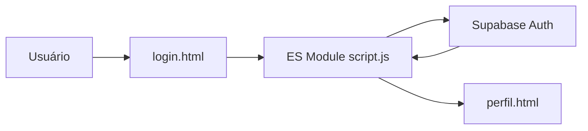

# RF-001 — Autenticar usuário

## 1. Identificação (2%)

| Campo | Valor |
|---|---|
| ID / título | RF-001 — Autenticar usuário |
| Tipo / prioridade | Funcional / Alta |
| Complexidade | Média, estimativa inicial de 5 story points (confirmar pela equipe). |
| Status | Fluxo migrado para Supabase Auth no código; teste com projeto configurado ainda pendente. |
| Projeto | Digital Ghost Software — Yokai Tales |
| Atualização | 23/09/2026 |

**Projeto/equipe:** Digital Ghost Software — Yokai Tales; integrantes conforme a relação do documento RF-004. Repositório informado: [AndreBlackDragon/YokaiTales-Webpage](https://github.com/AndreBlackDragon/YokaiTales-Webpage), branch `main`. Supabase: projeto `thmtriwgvsgxdinsuxph`. Deploy e Swagger não informados.

**Descrição breve:** permitir que um usuário com conta confirmada autentique-se por e-mail e senha e acesse o próprio perfil e as funções vinculadas à conta.

## 2. Descrição e atores (6%)

A autenticação identifica o usuário antes de apresentar dados pessoais, histórico de pedidos ou ações de conta. Isso evita associar pedidos a uma identidade informada livremente no navegador, mantém os dados de conta separados e permite controlar os acessos ao Supabase.

| Ator | Papel/responsabilidade | CRUD no escopo |
|---|---|---|
| Usuário | Informa credenciais e acessa a própria conta. | Read da própria sessão; não administra contas alheias. |
| Aplicação web | Envia credenciais ao Supabase Auth e direciona a navegação. | Solicita autenticação; não lê senha/hash do banco. |
| Supabase Auth | Valida credenciais, gerencia sessão e retorna usuário autenticado. | Create/Read/Update/Delete de credenciais conforme serviço e políticas do projeto. |

## 3. Casos de uso e RNF (15%)

### UC-001 — Entrar

**Pré-condições:** página carregada por HTTP/HTTPS; Supabase URL/chave publicável configuradas; conta existente e, se ativado no projeto, e-mail confirmado.

**Fluxo principal:** (1) usuário abre login; (2) informa e-mail; (3) informa senha; (4) envia o formulário; (5) cliente valida presença dos campos; (6) botão entra em estado de processamento; (7) a aplicação chama `supabase.auth.signInWithPassword`; (8) Supabase valida credenciais; (9) sessão é estabelecida pelo SDK; (10) interface apresenta confirmação; (11) usuário é redirecionado ao perfil. Em retorno de um checkout, a edição previamente escolhida é preservada.

**Pós-condições:** sucesso: sessão Supabase ativa; falha: sem mensagem de sucesso e usuário permanece na tela.

**Alternativos:** A1 campos vazios; A2 credenciais incorretas/e-mail não confirmado; A3 erro de rede ou configuração do Supabase. A aplicação apresenta mensagens sem revelar se determinado e-mail existe.

### Regras de negócio

| ID | Regra |
|---|---|
| RN-01 | E-mail e senha são obrigatórios. |
| RN-02 | A autenticação é delegada ao Supabase Auth. |
| RN-03 | Senhas não são consultadas ou comparadas por código do navegador. |
| RN-04 | Perfil e pedidos exigem usuário autenticado. |
| RN-05 | Logout chama `supabase.auth.signOut()` e limpa a sessão. |
| RN-06 | Mensagens de erro não exibem credenciais nem detalhes internos. |

### Requisitos não funcionais

| ID | Requisito | Verificação |
|---|---|---|
| RNF-01 | Senha nunca deve ser persistida no `localStorage` ou tabela de perfil. | Inspecionar chamadas/tabelas e armazenamento do navegador. |
| RNF-02 | Formulário responsivo e mensagens acessíveis por leitor de tela. | Validar em 320/1024 px e `aria-live`. |
| RNF-03 | Login, falha e logout devem concluir sem estado falso de sessão. | Demonstrar com conta de teste; execução pendente. |

## 4. Protótipo funcional (50%)

- Página: `paginas/login.html`.
- Implementação: `js/script.js` e `js/supabase-config.js`.
- Estados codificados: inicial, incompleto, processando, erro e sucesso/redirecionamento.
- Persistência de sessão: SDK Supabase Auth.
- Esta branch prepara o deploy integrado na Vercel; a URL final ainda não foi atribuída. O login usa diretamente o Supabase Auth; perfil e operações de compra/download dependem da API Node.js publicada. Não foi fornecida conta de demonstração/teste.

## 5. Arquitetura e ADR (15%)

#### ADR-001 — Supabase Auth
- **Status:** Implementado no cliente; validar configuração do projeto.
- **Contexto:** credenciais não devem ser comparadas no navegador.
- **Decisão:** autenticação pelo SDK oficial do Supabase.
- **Alternativas:** tabela própria de senhas em texto; backend próprio. A tabela própria insegura foi removida do fluxo.

#### ADR-002 — JavaScript ES Modules
- **Status:** Implementado.
- **Contexto:** cliente Supabase é importado como módulo.
- **Decisão:** carregar `script.js` com `type="module"`.
- **Alternativas:** script clássico com dependências globais; build bundler.

#### ADR-003 — Metadados de perfil no Auth
- **Status:** Implementado para nome; perfil adicional ainda não modelado.
- **Contexto:** nome precisa ser exibido depois do login.
- **Decisão:** gravar nome em `user_metadata.full_name` no cadastro.
- **Alternativas:** tabela de perfil dedicada (futura expansão); antiga tabela que misturava credencial e perfil.

#### ADR-004 — Sessão mantida pelo SDK
- **Status:** Implementado pelo SDK.
- **Contexto:** identificadores arbitrários em `localStorage` não provam login.
- **Decisão:** consultar sessão/usuário por `supabase.auth` e sair pelo SDK.
- **Alternativas:** usar e-mail do usuário como chave de login local; não adotada.

## 6. Segurança OWASP (12%)

| Risco | Controle no código | Teste requerido |
|---|---|---|
| A07 — Authentication Failures | Supabase Auth; senha não selecionada da tabela pelo cliente. | Login válido/inválido, confirmação e logout; pendente. |
| A01 — Broken Access Control | Perfil obtém o usuário com `auth.getUser()` e redireciona sessão ausente. | Abrir perfil sem sessão e verificar redirect; testar isolamento de duas contas. |
| A02 — Cryptographic Failures | Senha entregue ao serviço de Auth, sem armazenamento próprio pela aplicação. | Conferir ausência de senha em `Usuario`, `localStorage` e chamadas da aplicação; depende da configuração Supabase. |

Não há screenshots/logs de testes anexados nesta versão.

## Checklist

- [x] Código de login usa Supabase Auth; não consulta `senha_usuario`.
- [x] Há estados de processamento e mensagens de falha/sucesso.
- [ ] Validar cadastro/login/logout no projeto Supabase real.
- [ ] Demonstrar a 320 px/1024 px e anexar evidência.
- [ ] Publicar site e API integrados na Vercel e disponibilizar conta de teste apropriada.
- [ ] Executar e documentar testes de segurança.

**Fontes:** documentos do professor fornecidos, requisitos v15 e arquivos do projeto. A documentação descreve o estado local do código; não atesta comportamento no Supabase remoto.
