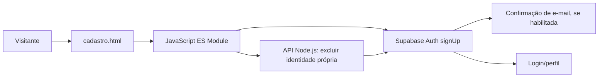

# RF-002 — Cadastrar usuário

## 1. Identificação (2%)

| Campo | Valor |
|---|---|
| ID / título | RF-002 — Cadastrar usuário |
| Tipo / prioridade | Funcional / Alta |
| Complexidade | Média, estimativa inicial de 5 story points (confirmar pela equipe). |
| Status | Código atualizado para Supabase Auth; execução integrada ainda precisa ser validada. |
| Projeto | Digital Ghost Software — Yokai Tales |
| Atualização | 23/09/2026 |

**Projeto/equipe:** Digital Ghost Software — Yokai Tales; integrantes conforme a relação do documento RF-004. Repositório informado: [AndreBlackDragon/YokaiTales-Webpage](https://github.com/AndreBlackDragon/YokaiTales-Webpage), branch `main`. Supabase: projeto `thmtriwgvsgxdinsuxph`. Deploy e Swagger não informados.

**Descrição breve:** permitir criar uma conta com nome, e-mail e senha para usar as áreas autenticadas do site e registrar pedidos do Yokai Tales.

## 2. Descrição e atores (6%)

O cadastro identifica usuários que desejam manter uma conta e acompanhar seus pedidos. Ele reduz a necessidade de identificar usuários por valores digitados a cada ação, oferece uma sessão autenticável para o checkout e permite apresentar o perfil associado à conta.

| Ator | Papel e responsabilidade | CRUD no escopo |
|---|---|---|
| Visitante | Informa nome, e-mail e senha e confirma a senha. | Solicita Create para a própria conta. |
| Aplicação web | Valida campos básicos, envia credenciais/metadados e permite ao usuário atualizar nome/senha e solicitar exclusão. | Solicita Create/Read/Update/Delete da própria conta via Auth/Node API; não grava senha em tabela própria. |
| Supabase Auth e API Node.js | Auth cria identidade, gerencia credenciais e atualiza nome; API valida sessão e exclui apenas a identidade autenticada. | Create/Read/Update de dados próprios; Delete próprio exige chave administrativa exclusivamente no servidor. |

## 3. Caso de uso e RNF (15%)

### UC-002 — Criar conta

**Pré-condições:** página servida por HTTP/HTTPS; configuração Supabase válida; usuário ainda não possui conta com o e-mail.

**Fluxo principal:** (1) visitante abre cadastro; (2) informa nome; (3) informa e-mail; (4) informa senha; (5) confirma senha; (6) envia o formulário; (7) aplicação valida campos obrigatórios; (8) valida igualdade das senhas; (9) valida mínimo de oito caracteres; (10) apresenta estado de processamento; (11) chama `supabase.auth.signUp`; (12) envia `full_name` como metadado; (13) exibe confirmação ou instrução para confirmar e-mail; (14) quando a sessão for criada imediatamente, direciona ao login.

**Pós-condições:** sucesso: conta criada no Auth e nome associado à identidade; se confirmação de e-mail estiver habilitada, acesso aguarda confirmação. Falha: cadastro não informa sucesso nem inicia fluxo de compra.

**Alternativos:** A1 dados obrigatórios ausentes; A2 senhas diferentes/curtas; A3 e-mail já cadastrado ou inválido; A4 serviço/rede indisponível. Mensagem é exibida na tela.

### Regras de negócio

| ID | Regra |
|---|---|
| RN-01 | Nome e e-mail não podem ficar vazios. |
| RN-02 | E-mail deve ser validado pelo campo de tipo e pelo Supabase Auth. |
| RN-03 | E-mail identifica unicamente uma conta no Auth. |
| RN-04 | Senha deve ter pelo menos oito caracteres. |
| RN-05 | Confirmação deve ser idêntica à senha. |
| RN-06 | Senha não é salva na tabela `Usuario` nem em `localStorage` pelo código da aplicação. |
| RN-07 | Confirmação de e-mail depende da configuração de Auth do projeto Supabase. |

### Requisitos não funcionais

| ID | Requisito | Critério |
|---|---|---|
| RNF-01 | Proteção de credenciais | Serviço Supabase Auth gerencia senha; validar configuração e fluxo real. |
| RNF-02 | Usabilidade/acessibilidade | Erros e estados do formulário anunciados via `aria-live`; conferir visualmente. |
| RNF-03 | Compatibilidade | Formulário utilizável em 320 px e 1024 px; teste manual pendente. |

## 4. Protótipo funcional (50%)

- Tela: `paginas/cadastro.html`.
- Código cliente: `js/script.js`; API Node.js: `server/index.js` (leitura de perfil e exclusão autenticada; exclusão requer chave administrativa no servidor).
- Perfil permite consultar e atualizar nome e senha da própria identidade pelo Supabase Auth.
- Exclusão da identidade pede confirmação explícita e senha atual; `server/index.js` valida o token e apaga somente a identidade autenticada. A API precisa ser publicada e configurada com `SUPABASE_SERVICE_ROLE_KEY` como segredo exclusivamente server-side.
- Estados: vazio, preenchimento, campos inválidos, criação/processamento e sucesso/confirmação pendente.
- O cadastro usa Supabase Auth e armazena o nome em `user_metadata.full_name`.
- Esta branch prepara site e API integrados na Vercel; a URL final ainda não foi atribuída. A integração depende das variáveis Supabase, aplicação da migração SQL e screenshots de demonstração.

## 5. Arquitetura e ADR (15%)

#### ADR-001 — Supabase Auth para identidades
- **Status:** Implementado no código; configuração externa a validar.
- **Contexto:** feedback anterior apontou autenticação sem funcionalidade e dados em Local Storage.
- **Decisão:** criar conta por `supabase.auth.signUp`.
- **Alternativas:** tabela `Usuario` com senha em texto (fluxo legado, não usado no código atualizado); backend próprio.

#### ADR-002 — Nome em metadado de usuário
- **Status:** Implementado.
- **Contexto:** o perfil precisa exibir nome sem misturar credencial e dados de conta.
- **Decisão:** fornecer `full_name` como user metadata.
- **Alternativas:** duplicar o nome em armazenamento local; criar uma tabela de perfil com RLS.

#### ADR-003 — Validação no cliente e no provedor
- **Status:** Parcialmente implementado.
- **Contexto:** feedback rápido e integridade de conta.
- **Decisão:** validar campos/igualdade/comprimento no formulário e deixar unicidade/credenciais ao Auth.
- **Alternativas:** confiar apenas em validação cliente; implementar serviço próprio.

#### ADR-004 — Confirmação de e-mail controlada pela configuração Auth
- **Status:** Dependente da configuração do projeto.
- **Contexto:** o comportamento muda conforme a confirmação de e-mail esteja habilitada.
- **Decisão:** tratar `data.session` ausente como confirmação pendente e orientar o usuário.
- **Alternativas:** desativar confirmação globalmente; afirmar cadastro ativo sem conferir sessão.

#### ADR-005 — API Node.js para exclusão de conta
- **Status:** Código preparado em `server/index.js`; deploy e secrets pendentes.
- **Contexto:** feedback do professor exige Node.js; exclusão administrativa de `auth.users` não pode usar chave service role no navegador.
- **Decisão:** API Node.js valida o token Supabase do solicitante e exclui somente o `user.id` associado.
- **Alternativas:** colocar service role no cliente (inseguro); Supabase Edge Function (não atende ao requisito explícito de Node.js); remover apenas dados do frontend.

## 6. Segurança OWASP (12%)

| Risco | Controle | Teste requerido |
|---|---|---|
| A07 — Authentication Failures | Serviço de Auth gerencia credenciais e e-mail único. | Tentar duplicidade, senha inválida, confirmação e login; pendente. |
| A02 — Cryptographic Failures | Código não persiste a senha na tabela própria. | Inspecionar tabelas legadas e requisições; verificar Auth no painel. |
| A04 — Insecure Design | Verificações de campos, confirmação e tamanho reduzem cadastros malformados. | Testar campos vazios, senha divergente/curta e serviço offline. |
| A01 — Broken Access Control | API Node.js valida token e limita exclusão ao `user.id` autenticado. | Testar sem token, token inválido e exclusão própria após publicar a API; pendente. |

Screenshots e resultados de testes não foram anexados.

## Checklist

- [x] Código usa fluxo `signUp` e valida campos/senhas.
- [x] Fluxo de confirmação de e-mail é tratado conforme a resposta do Auth.
- [ ] Publicar a API Node.js com secrets server-side e testar exclusão controlada.
- [ ] Testar integração com o projeto Supabase da equipe.
- [ ] Revisar migração de contas legadas que estavam na tabela `Usuario`; senhas antigas não são migradas automaticamente.
- [ ] Anexar evidência visual e testes de segurança.
- [ ] Publicar site e API Node.js integrados na Vercel e disponibilizar conta de demonstração segura.

**Fontes:** feedback do professor, RF-002 anteriormente enviado, requisitos v15 e código do projeto. As contas legadas permanecem sem migração automática para Auth.
