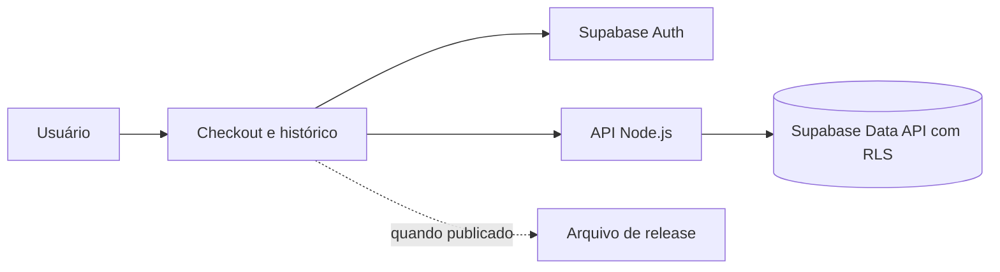

# RF-003 — Gerenciar download do jogo

## 1. Identificação (2%)

| Campo | Valor |
|---|---|
| ID / título | RF-003 — Gerenciar download do jogo |
| Tipo / prioridade | Funcional / Alta |
| Complexidade | Média, estimativa inicial de 5 story points (confirmar com a equipe). |
| Status | Página de compra e histórico preparados; site publicado no GitHub Pages; API e artefato/URL de release ainda não foram informados. |
| Atualização | 23/09/2026 |

**Projeto/equipe:** Digital Ghost Software — Yokai Tales; integrantes conforme a relação do documento RF-004. Repositório informado: [AndreBlackDragon/YokaiTales-Webpage](https://github.com/AndreBlackDragon/YokaiTales-Webpage), branch `main`. Supabase: projeto `thmtriwgvsgxdinsuxph`. Deploy e release do jogo não informados.

**Descrição breve:** após identificar o usuário e confirmar o direito de acesso previsto pelo projeto, apresentar o arquivo de Yokai Tales para download e manter estado/histórico de pedidos relacionado.

## 2. Descrição e atores (6%)

O download permite que o jogador obtenha a versão publicada do jogo. O feedback do professor registrou que a demonstração de download foi apresentada e sugeriu controle e histórico de downloads. A equipe informou que ainda não existe link do arquivo, portanto essa entrega não pode liberar um binário real.

| Ator | Responsabilidade | CRUD |
|---|---|---|
| Usuário autenticado | Consulta seus pedidos e aciona o download quando houver release. | Read dos próprios pedidos; solicita download autorizado. |
| Aplicação web | Exibe edição, estado e link de release configurado. | Read e navegação ao recurso. |
| Supabase Auth/PostgreSQL | Valida identidade e retorna pedidos próprios. | Read conforme RLS. |

## 3. Casos de uso e RNF (15%)

### UC-003 — Consultar pedido e baixar release

**Pré-condições:** usuário autenticado; pedido no Supabase; release publicado em endereço autorizado e configurado.

**Fluxo principal:** (1) usuário abre comprar/download; (2) aplicação consulta a sessão; (3) consulta pedidos do próprio `auth.uid()`; (4) mostra edição e estado; (5) verifica se URL de release foi configurada; (6) mostra CTA de download; (7) usuário aciona o link; (8) navegador inicia o download do arquivo publicado.

**Pós-condições:** arquivo disponível no dispositivo; o pedido permanece no histórico. Falha: mensagem explica ausência de pedido, sessão ou arquivo.

**Alternativos:** A1 sessão ausente: solicitar login; A2 histórico vazio: orientar compra; A3 release indisponível: mostrar pendência sem link quebrado; A4 falha de rede: manter histórico e permitir nova tentativa.

### Regras de negócio

| ID | Regra |
|---|---|
| RN-01 | Usuário vê somente pedidos próprios. |
| RN-02 | O pedido simulado aprovado não equivale a pagamento real. |
| RN-03 | O link de download só aparece quando uma release estiver publicada e configurada. |
| RN-04 | Plus inclui conteúdo adicional conforme a definição comercial informada pela equipe. |
| RN-05 | A aplicação não hospeda arquivo local inexistente nem usa link de busca/imagem como release. |
| RN-06 | Publicação/atualização de versão exige que a equipe substitua o endereço configurado por URL controlada. |

### Requisitos não funcionais

| ID | Requisito | Verificação |
|---|---|---|
| RNF-01 | Download acessível por HTTPS e com nome/tamanho/versão conhecidos. | Ainda não verificável: release não publicada. |
| RNF-02 | Interface responsiva e estado pendente compreensível. | Revisão visual em 320/1024 px pendente. |
| RNF-03 | Acesso a pedidos isolado pelo Supabase RLS. | Teste com duas contas pendente. |

## 4. Protótipo funcional (50%)

- Página: `paginas/download.html`.
- Código: `js/script.js`.
- API Node.js: `GET /api/payments`, `POST /api/payments`, `POST /api/downloads` em `server/index.js`.
- Dados: pedidos em `simulated_payments` e histórico de solicitações em `game_downloads`, ambos descritos em `database/ddl/rf-004-simulated-payments.sql`.
- O histórico aparece após executar a migração Supabase. O código informa claramente que o arquivo de download está pendente até ser publicada uma URL real.
- Feedback: protótipo de RF-003 recebeu 90% segundo o registro semanal, com sugestão de histórico/controle. A documentação não havia sido entregue. O estado atual do protótipo precisa de nova demonstração; o número histórico não certifica esta revisão.

## 5. Arquitetura e ADR (15%)

#### ADR-001 — Histórico de pedidos no Supabase
- **Status:** Preparado por migração; execução pendente.
- **Contexto:** professor sugeriu histórico/controle de downloads.
- **Decisão:** usar registro de pedido como histórico inicial, consultado por titular.
- **Alternativas:** não registrar downloads; manter apenas dados locais.

#### ADR-002 — Link de release configurável
- **Status:** Pendente de arquivo/URL.
- **Contexto:** repositório não contém o binário.
- **Decisão:** não reutilizar links temporários/de terceiros; configurar URL quando houver release autorizada.
- **Alternativas:** hospedar binário no GitHub Releases ou storage controlado; equipe ainda não decidiu.

#### ADR-003 — Autorização via sessão e RLS
- **Status:** Código/migração preparados; validar depois da aplicação.
- **Contexto:** histórico não pode vazar entre usuários.
- **Decisão:** sessão Supabase e políticas por `auth.uid()`.
- **Alternativas:** e-mail fornecido livremente pelo navegador; leitura aberta.

#### ADR-004 — Página de download sem simular arquivo
- **Status:** Implementado como estado pendente.
- **Contexto:** ainda não existe artefato real.
- **Decisão:** informar indisponibilidade até publicação, sem prometer um download que não existe.
- **Alternativas:** apontar para imagem ou conteúdo de terceiros; rejeitada.

## 6. Segurança OWASP (12%)

| Risco | Controle | Teste requerido |
|---|---|---|
| A01 — Broken Access Control | Consulta de pedidos com `auth.uid()` e RLS. | Tentar obter pedido de outra conta; pendente. |
| A05 — Security Misconfiguration | Não há link externo genérico codificado para o arquivo; URL permanece vazia até configurar release. | Inspecionar build e testar CTA sem configuração. |
| A08 — Software/Data Integrity | A release deve vir de endereço controlado e versionado pela equipe. | Verificar checksum/versão da release quando houver; pendente. |

Não há arquivo, checksum ou evidência de teste de release ainda.

## Checklist

- [x] Estado de arquivo ausente apresentado sem apontar para mídia aleatória.
- [x] Requisito de histórico previsto via pedidos Supabase.
- [ ] Publicar arquivo Standard e Plus ou explicar empacotamento dos conteúdos.
- [x] Registrar URL do site: <https://rapha3lmendess.github.io/Digital-Web-Site/>.
- [ ] Publicar/configurar URL da API e definir release permanente e política de versão.
- [ ] Executar teste da migração/RLS e registrar evidências.
- [ ] Fazer demonstração pública com usuário de teste.

**Fontes:** feedback semanal do professor, decisões informadas pelo usuário, requisitos v15 e arquivos locais. O feedback menciona download funcional na apresentação anterior, mas o arquivo/URL atual não foi fornecido.
